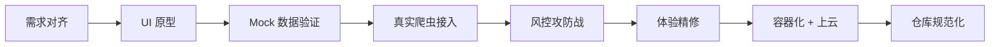

# TrendBoard 项目复盘：从零到云端的多平台实时资讯聚合系统

> 🟠 **复盘四步法**：回顾目标 → 评估结果 → 分析原因 → 总结规律

---

## 一、项目概览

| 维度 | 内容 |
|------|------|
| **产品定位** | 高端画报风格的多平台实时热点聚合 Web 大盘 |
| **覆盖平台** | Bilibili（视频）· 小红书（种草）· 雪球（财经） |
| **技术栈** | FastAPI + Playwright + httpx + Docker |
| **交付形态** | Docker 容器化，单端口（8000）前后端一体化服务 |
| **开发周期** | 1 个 Session，从需求对齐到 Git 封版 + 云端部署指南 |

---

## 二、全链路演进时间线



### Phase 1：需求对齐与 UI 原型
- **输入**：用户想要一个能看多平台热点的网页
- **关键决策**：先出 UI 再接数据，避免"功能做完了但丑得没人用"
- **产出**：深色画报风格的三栏卡片布局（`index.html` + `style.css`）

### Phase 2：爬虫引擎建设与风控攻防
- **B站**：API 直连 → `-352` 鉴权拦截 → Playwright 无头渲染 → 发现过度伪装反而触发沙盒检测 → 回归轻量 httpx + `buvid3` UUID 伪造，**一击命中**
- **小红书**：API 全线加密 → 放弃逆向 → Playwright DOM 物理提取 → 成功
- **雪球**：WAF 拦截 → Playwright 绕过 → DOM 宽泛选择器提取 → 成功

### Phase 3：交互优化
- 移除自动轮询 → 改为用户手动"立即同步"
- 全面汉化（标题/按钮/标签）
- 卡片点击穿透 → 直达原文详情页

### Phase 4：云端交付
- 前后端聚合（StaticFiles 托管）
- Docker 容器化（基于微软 Playwright 官方镜像）
- Git 仓库规范化（README / LICENSE / .gitignore）

---

## 三、核心方法论提炼（可推广可复制）

### 🔧 方法论 1：差异化抓取策略矩阵

> **核心原则**：不存在一种万能的爬虫方案。每个平台的防御体系不同，必须对症下药。

```
┌─────────────────────────────────────────────────────────────┐
│              平台抓取策略决策树                                │
├─────────────────────────────────────────────────────────────┤
│                                                             │
│  目标平台有公开 API？                                        │
│    ├── YES → API 是否需要签名/鉴权？                         │
│    │    ├── 无签名 → httpx 裸请求（最快）                    │
│    │    ├── 简单鉴权 → 伪造 Cookie/Token 绕过               │
│    │    │    例：B站 buvid3=random UUID                     │
│    │    └── 复杂签名（Wbi/HMAC）→ 放弃 API，转 DOM 方案     │
│    └── NO → 页面是否为 SSR（服务端渲染）？                    │
│         ├── YES → httpx 直接拉 HTML + BeautifulSoup 解析    │
│         └── NO (SPA/CSR) → Playwright 无头浏览器渲染后提取   │
│                                                             │
│  ⚠️ 反直觉经验：                                            │
│  · 过度伪装 UA 反而触发沙盒检测（B站教训）                    │
│  · 最简单的 Cookie = 最难被识别的指纹                        │
│  · DOM 选择器要宽泛，平台改版后不至于全挂                     │
│                                                             │
└─────────────────────────────────────────────────────────────┘
```

**复制要点**：
1. 先尝试最轻量的方案（httpx），失败后再逐级升重
2. 不要一上来就用 Playwright——启动慢、资源重、维护成本高
3. 每个平台的爬虫模块独立隔离（`scrapers/xxx.py`），一个挂了不影响其他

---

### 🛡️ 方法论 2：反风控攻防四象限

| | 低复杂度 | 高复杂度 |
|---|---|---|
| **低对抗** | httpx + 标准 Headers | httpx + Cookie/Token 伪造 |
| **高对抗** | Playwright + 默认指纹 | Playwright + 行为模拟（滑动/等待） |

**决策规则**：
- 从左上角开始，逐格升级
- 每次升级前先验证当前方案是否真的被拦了（用探针脚本）
- **奥卡姆剃刀原则**：能用简单方案解决的，绝不加复杂度

**本项目实战路径**：

| 平台 | 起点 | 最终落点 | 跳了几格 |
|------|------|---------|---------|
| B站 | httpx 裸请求 | httpx + buvid3 伪造 | 1 格 |
| 小红书 | httpx（失败） | Playwright + DOM 提取 | 2 格 |
| 雪球 | httpx（失败） | Playwright + WAF 绕过 | 2 格 |

---

### 🏗️ 方法论 3：聚合类产品的标准化工程骨架

任何「多源数据 → 统一展示」的产品，都可以复用以下架构模板：

```
project-root/
├── index.html              # 展示层（纯静态，零框架依赖）
├── style.css               # 设计系统（深色/浅色主题可切换）
├── script.js               # 交互层（fetch → render，解耦数据与视图）
├── Dockerfile              # 部署层（环境不可变性保障）
├── requirements.txt        # 依赖锁（精确版本号）
└── backend/
    ├── main.py             # 网关层（FastAPI：路由 + 缓存 + 静态托管）
    └── scrapers/           # 数据层（每个源一个文件，独立隔离）
        ├── source_a.py
        ├── source_b.py
        └── source_c.py
```

**关键设计原则**：
1. **源隔离**：每个数据源一个 `.py`，暴露统一的 `async def fetch_xxx() -> list[dict]` 接口
2. **降级兜底**：任何一个源挂了，返回降级提示，不影响其他源
3. **缓存中台**：后端维护 `cache` 字典，`GET /api/trends` 读缓存，`POST /api/sync` 刷缓存
4. **前后端一体**：FastAPI 的 `StaticFiles` 直接托管前端，单端口对外

---

### 🚀 方法论 4：从本地到云端的三步上线法

```
┌──────────────┐    ┌──────────────┐    ┌──────────────┐
│  Step 1      │    │  Step 2      │    │  Step 3      │
│  本地验证     │───▶│  Git 封版     │───▶│  Docker 上云  │
│              │    │              │    │              │
│ · 跑通所有源  │    │ · .gitignore │    │ · Dockerfile │
│ · 前端对接OK  │    │ · README.md  │    │ · 安全组8000  │
│ · API 返回正常│    │ · LICENSE    │    │ · docker run │
└──────────────┘    └──────────────┘    └──────────────┘
```

**每步的验收标准（不满足不进入下一步）**：
- **Step 1**：`curl localhost:8000/api/sync` 返回三个平台的真实数据
- **Step 2**：`git ls-files` 无测试残留，`README` 含完整使用说明
- **Step 3**：`http://<公网IP>:8000` 可正常访问并同步数据

---

### ⚡ 方法论 5：爬虫故障的 RCA 快速定位流程

当某个平台突然抓不到数据时：

```
1. 确认是 0 数据还是报错数据
   ├── 报错信息 → 直接读报错内容
   └── 空数组 → 进入 Step 2

2. 用探针脚本独立验证（脱离主服务）
   python -c "from scrapers.xxx import fetch_xxx; ..."
   ├── 探针也失败 → 平台侧变化，进入 Step 3
   └── 探针成功 → 主服务集成问题（并发/超时/资源竞争）

3. 判断失败类型
   ├── HTTP 状态码异常（403/412/-352）→ 鉴权/签名问题
   ├── 200 但空内容 → 风控返回了空壳页面
   └── 超时 → 网络/Playwright 启动延迟

4. 按「反风控四象限」升级方案
   当前象限不行 → 右移或下移一格
   切记：不要在同一个象限里反复微调参数
```

---

## 四、踩坑备忘录（血泪经验）

| # | 坑 | 症状 | 根因 | 解法 | 可推广性 |
|---|---|---|---|---|---|
| 1 | B站 API `-352` | 接口返回空 JSON | Wbi 签名校验收紧 | 伪造 `buvid3` Cookie | ⭐⭐⭐ 适用于所有需要 Cookie 但不校验签名的 API |
| 2 | B站 Playwright 空壳 | DOM 查询 0 结果 | 自定义 UA 触发沙盒，返回移动版空壳页 | **删除**所有伪装，用 Chromium 原生指纹 | ⭐⭐⭐⭐⭐ 通用法则：少即是多 |
| 3 | Playwright `browser.close()` 时序 | `Target page has been closed` | 先关浏览器再读 `page.content()` | 确保所有页面操作在 `close()` 之前完成 | ⭐⭐⭐⭐ 异步资源管理通病 |
| 4 | 前端 `localhost` 硬编码 | 部署到云端后前端请求全挂 | `fetch('http://localhost:8000/...')` | 改为相对路径 `fetch('/api/...')` | ⭐⭐⭐⭐⭐ 所有前后端项目必须遵守 |
| 5 | 仓库裸推无 README | GitHub 页面一片空白 | Owner 意识不到位 | README + LICENSE + .gitignore 三件套 | ⭐⭐⭐⭐⭐ 开源项目基本功 |

---

## 五、交付物清单

| 文件 | 职责 | 行数 |
|------|------|------|
| [index.html](file:///d:/antigravity/trend-board/index.html) | 前端入口（中文化画报界面） | ~50 |
| [style.css](file:///d:/antigravity/trend-board/style.css) | 深色高端视觉系统 | ~150 |
| [script.js](file:///d:/antigravity/trend-board/script.js) | 交互逻辑（手动同步 + 卡片穿透） | ~80 |
| [backend/main.py](file:///d:/antigravity/trend-board/backend/main.py) | FastAPI 网关 + 静态托管 | ~68 |
| [backend/scrapers/bilibili.py](file:///d:/antigravity/trend-board/backend/scrapers/bilibili.py) | B站爬虫（httpx + buvid3） | ~32 |
| [backend/scrapers/xhs.py](file:///d:/antigravity/trend-board/backend/scrapers/xhs.py) | 小红书爬虫（Playwright DOM） | ~30 |
| [backend/scrapers/xueqiu.py](file:///d:/antigravity/trend-board/backend/scrapers/xueqiu.py) | 雪球爬虫（Playwright WAF 绕过） | ~30 |
| [Dockerfile](file:///d:/antigravity/trend-board/Dockerfile) | 容器化构建（Playwright 镜像） | ~15 |
| [README.md](file:///d:/antigravity/trend-board/README.md) | 项目文档（徽章 + 架构图 + 部署指南） | ~130 |

---

## 六、后续演进建议

| 方向 | 具体动作 | 优先级 |
|------|---------|:-----:|
| **数据持久化** | 接入 Redis/SQLite，支持历史热点回溯 | P1 |
| **数据源扩展** | 接入微博热搜、知乎热榜、抖音（套用 scrapers 模板） | P1 |
| **定时任务** | 后端 cron 定时抓取，前端展示"上次同步时间" | P2 |
| **告警监控** | 某个源连续 N 次失败时推送通知（企微/钉钉 Webhook） | P2 |
| **Playwright 连接池** | 复用浏览器实例，减少冷启动开销 | P3 |
| **CDN + HTTPS** | 腾讯云 CLB + 免费证书，提升访问体验 | P3 |

---

## 七、一句话总结

> **做聚合产品的底层逻辑**：不要试图用一把钥匙打开所有的门。每个数据源都是一场独立的攻防战——先侦察、再选武器、打不过就换打法。但无论武器怎么换，后面的「缓存 → API → 前端」这条管道是标准化的、可复制的。把变化的部分隔离在 `scrapers/` 目录里，把不变的部分固化在架构里。这就是可推广的核心：**变化隔离，管道复用。**
